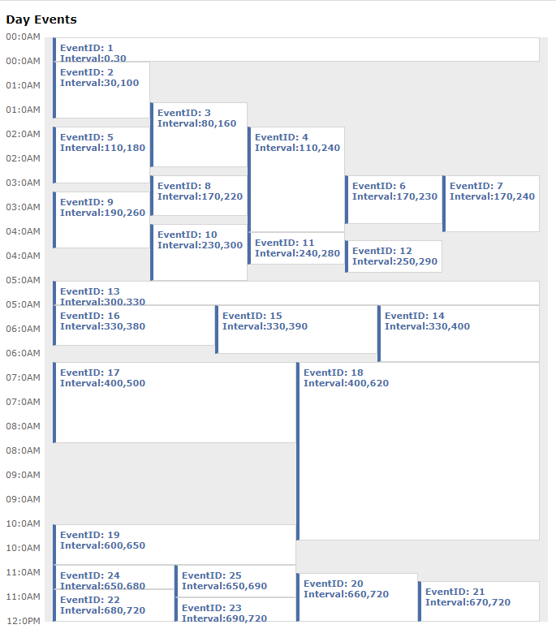

# React Day Event Calendar



-   Ported this codepen [Day Event calendar](https://codepen.io/nuweb/pen/ifshB) by nuweb into a React Component
-   Still under construction, I hope to add a ton of customization parameters to this component

## How to run

```
$ npm i
$ npm run start
```

## Example Use

```jsx
ev = [
    /* The start and end time for events in minutes*/
];
genEvents = new GenerateDayEvents(ev);

// for each gen event, you may add a custom component manually, as well as set the color
genEvents;

// Defining the range of your calendar
start = start || 0;
end = end || 720;
step = step || 30;
let times = [...Array(Number((end - start) / step) + 1)].map(
    (el, ind) => ind * step + start
);
return (
    <div>
        <p>Day Events </p>
        {/*Generating the times*/}
        <ol>
            {times.map((i) => {
                let hour = Math.floor(i / step / 2);
                return (
                    <li>
                        <span className="hours">
                            {hour < 10 ? `0${hour}` : hour}:{i % step}
                        </span>
                        {i < 720 ? "AM" : "PM"}
                    </li>
                );
            })}
        </ol>
        <div id="day-event-container" class="day-event-container">
            {genEvents.map(
                ({
                    id,
                    top,
                    left,
                    width,
                    height,
                    start: s,
                    end: e,
                    Component = (
                        <Fragment>
                            <div className="evt-txt">EventID: {id}</div>
                            <span class="evt-txt">
                                Interval:{s},{e}
                            </span>
                        </Fragment>
                    ),
                }) => {
                    return (
                        <div
                            class="day-event"
                            id={id}
                            style={{ top, left, width, height }}
                        >
                            <Component />
                        </div>
                    );
                }
            )}
        </div>
    </div>
);
```
